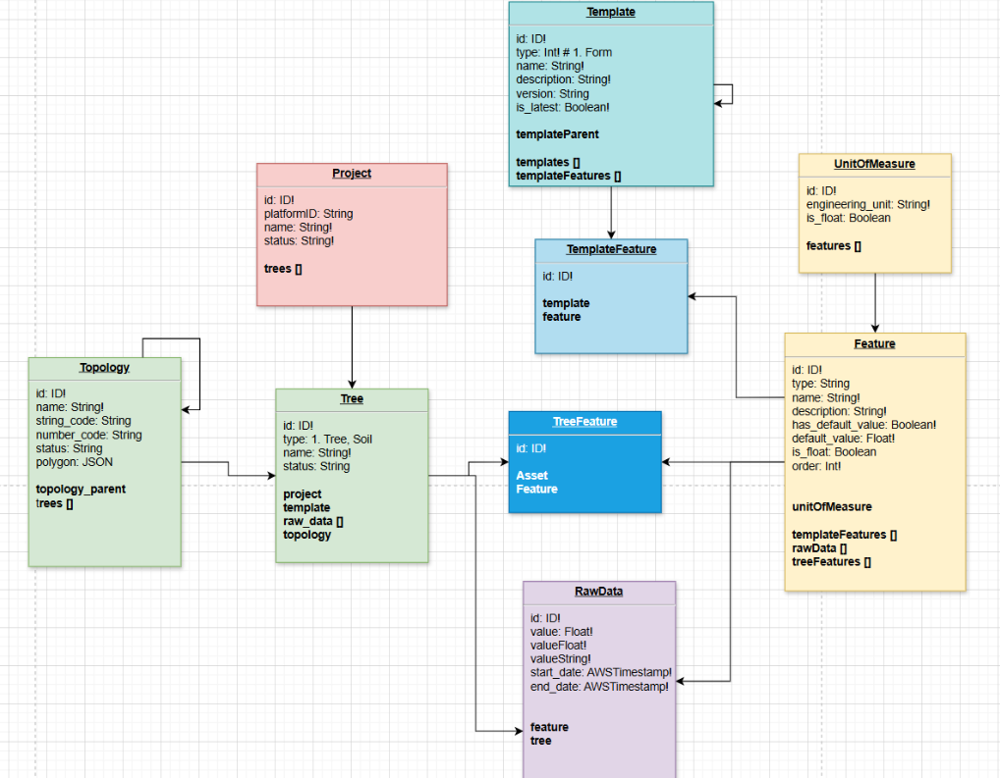
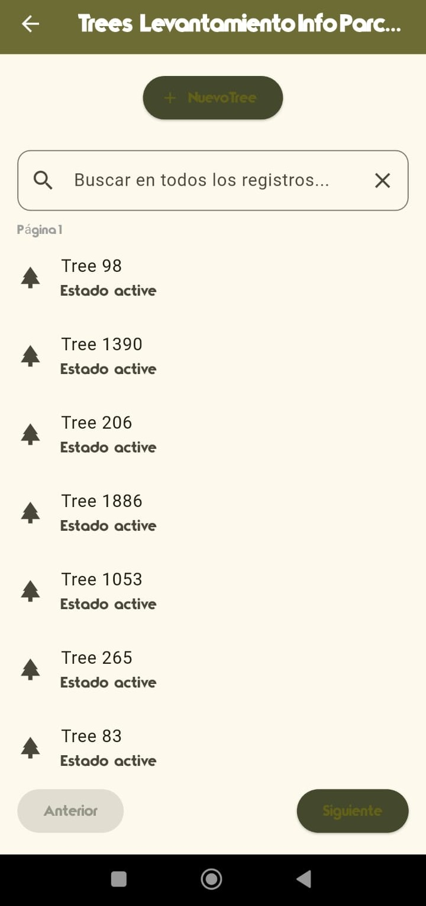

# Hay que actualizar el README.md

# Oráculo Terrasacha – Formulario App Móvil

## 🎯 Objetivo de la App

Desarrollar un nuevo proyecto en **Flutter (multiplataforma)** para crear una herramienta tipo formulario que permita:

- Capturar datos
- Guardarlos localmente
- Sincronizarlos posteriormente con la nube

---

## ⚙️ Requisitos Funcionales

- Por definir

---

## 🔒 Requisitos No Funcionales

- Por definir

---

## 🏗️ Arquitectura del Proyecto

Por completar. Actualmente se contemplan los siguientes componentes:

### 📱 Cliente
44 
Corresponde a todo lo que ve y usa el usuario en el dispositivo móvil:

- Peticiones
- Vistas
- Exportaciones a CSV
- Interacción general con la aplicación

### 💾 Backend Local

Encargado de la lógica interna de la aplicación:

- Construcción de *schemas*
- Almacenamiento local de datos
- Sincronización con la nube cuando haya conexión

### ☁️ Backend Externo

Destino final de los datos ya estructurados, donde se completa la sincronización mediante **GraphQL**.

---

## 🔄 Diagrama de Flujo del Proyecto

Se construyó un diagrama de flujo que modela el comportamiento de la aplicación tipo formulario, mostrando el ciclo completo desde la captura de datos hasta la sincronización con la nube.

El diagrama se divide en dos flujos:

- **Lado izquierdo:** Interacción del usuario con la aplicación
- **Lado derecho:** Proceso de sincronización automática de la app

---

## 📝 Flujo de Captura de Datos (Lado Izquierdo)

1. **Inicio de la aplicación**  
   El usuario abre la aplicación móvil e inicia el flujo.

2. **Menú Proyectos**
    - Crear un nuevo proyecto (nombre o ID único)
    - Seleccionar un proyecto existente  
      Al finalizar, se accede al **Menú de Parcelas**.

3. **Menú Parcelas**
    - Crear una nueva parcela
    - Seleccionar una parcela existente

4. **Captura de datos**
   El usuario diligencia un formulario con:
    - Fecha
    - Coordenadas
    - Observaciones
    - Mediciones
    - Otros datos relevantes

5. **Validación de datos**
    - El sistema valida integridad y formato
    - Si hay errores, el usuario debe corregirlos

6. **Almacenamiento local**
    - Los datos se guardan en el dispositivo
    - La app funciona **offline**
    - Los registros quedan marcados como *pendientes de sincronización*

---

## ☁️ Flujo de Sincronización con la Nube (Lado Derecho)

1. **Inicio de sincronización**
    - El usuario inicia la sincronización desde el menú

2. **Verificación de conexión**
    - Se valida conexión WiFi o datos móviles
    - Si no hay conexión, se muestra un error

3. **Verificación de datos pendientes**
    - Se comprueba si existen registros por sincronizar
    - Si no existen, se notifica al usuario

4. **Envío de datos**
    - Los datos se envían a la nube mediante una petición **API**

5. **Validación del envío**
    - Si ocurre un error, los datos permanecen en local
    - Se muestra un mensaje de fallo

6. **Gestión de datos locales**
    - Si el envío es exitoso, los datos se marcan como sincronizados
    - Se conservan por **7 días** como respaldo
    - Luego se eliminan automáticamente

---

##  Avances del Proyecto (MVP - 29/12/2025)

- Implementación del formulario de captura de datos con validaciones y obtención de coordenadasFalsas.
- Diseño y aplicación del tema visual personalizado según el branding de Terrasacha.
- Actualización del framework Flutter a la versión más reciente para compatibilidad con dependencias.
- Recepción y análisis del endpoint y API Key de AWS AppSync para consumo de la API GraphQL.
- Estudio y comprensión del esquema GraphQL (`schema.graphql`) para planear la integración.
- Decisión estratégica de consumir la API GraphQL directamente con `graphql_flutter`, descartando el uso de Amplify CLI y DataStore para simplificar el desarrollo.
- Implementación de manejo básico de errores en navegación para facilitar la depuración.
- Eliminación temporal de la configuración de Amplify para estabilizar la aplicación y evitar errores críticos.

  

>Screen de captura de datos actualmente

> Se añadio un instalador para Android (Se esta trabajando en el de Iphone por motivos de licencia de Apple)

---

##  Avances del Proyecto (v0.2.0 - 03/01/2026)

- Implementación de base de datos local para guardado de registros offline, con creacion de nuevas Pantallas para Logica y navegacion:
   - **CapturaDatosScreen**: formulario para crear y editar registros con validación y guardado local en estado 'pendiente'.

  
  

   - **RevisionScreen**: pantalla de revisión en modo solo lectura con opción a editar registros en estado 'pendiente'.

  

   - **RegistrosGuardadosScreen**: listado de registros guardados localmente, con navegación a revisión y actualización automática al volver.

  

- Desarrollo de persistencia local usando SQLite a través de la clase `LocalDatabase`, con métodos para insertar, consultar y **editar** registros.

  

- Integración de navegación entre pantallas para permitir crear, revisar, editar y listar registros de forma fluida y consistente.
- Manejo del estado 'pendiente' para diferenciar registros editables de los sincronizados (futuros avances).
- Preparación del código para futura sincronización con backend en nube.
- Corrección de errores de compilación y mejora en la estructura del código para escalabilidad.

---

##  Avances del Proyecto (v0.3.0 - 11/01/2026)

- Se termino de desarrollar la estructura de base de datos local donde se guardara offline los datos registrados

  

> Diagrama de base de datos que se maneja de manera local

- **Proyecto:** Es la entidad raiz. Contiene Nombre y el ID unico del proyecto.
- **Predio:** Un proyecto puede tener multiples predios. Almacena el nombre, el ID y el area (GeoJSON) del predio.
- **Parcela:** Un predio se divide en varias parcelas. Aquí se define la especie (Eucalipto, Pino, etc.) y el área de la parcela.
- **Registro:** Es la unidad individual de cada arbol. Contiene las mediciones reales (DAP, altura, coordenadas GPS) y el estado de sincronización (pendiente/sincronizado).

- Se crearon Screens para la toma y envio de datos entre entidades:
   - **ProyectosMenuScreen:** Screen para creacion o seleccion de proyecto forestal.

  
  

   > Screen de Proyectos
  
   - **PrediosMenuScreen:** Organización de predios vinculados a cada proyecto.

  
  

   > Screen de Predios
     
   - **ParcelasMenuScreen:** Clasificación de parcelas con selección de especie (Eucalipto, Pino Caribe, etc.).

  
  

 
   > Screen de Parcelas

- Se actualizo la Screen de *Registros Guardados*

  

  > Screen de Registros Guardados

 - Integracion de GraphQL en la aplicacion. Se configuro el main.dart del proyecto para que se conecte al cliente graphql_flutter, implementando su endpoint y API KEY.

---

## Avances del Proyecto (v0.4.0 - 20/01/2026)

- Eliminacion del cliente **graphql_flutter** y migracion hacia AWS usando **Amplify API (AppSync GraphQL)**.

- Configuración de entorno AWS necesaria para integracion de Amplify en el proyecto Flutter:
  - Creación de cuenta en AWS y configuración de usuario **IAM** con permisos para AppSync/Amplify.
  - Ejecución de **amplify init** para vincular el proyecto Flutter con el backend en la nube.
  - Integración del archivo **amplifyconfiguration.dart** con el **endpoint** y la **API Key** del backend.

- Análisis completo del **schema.graphql**

- Actualizacion de la pantalla **SincronizacionScreen**:
  - Pantalla dedicada para ejecutar consultas de prueba contra la API GraphQL.
  - Botones para listar:
    - **Proyectos** (`listProjects`).
    - **Trees** (`listTrees`).
  - Área de texto tipo “consola” (componente **SelectableText** dentro de un **Container** con scroll, por si el texto es muy largo) que muestra en tiempo real el **Response** de la API, con formato tipo JSON.

    

     
    

- Consumo de API GraphQL mediante **Amplify API**:

  - Validación exitosa de las operaciones de los **@model**, como:
    - **listProjects:** listado de proyectos desde la nube.

      

        
        
      
   
      
    - **listTrees:** listado de árboles asociados a proyectos.
   
      

        
        
      

- Eliminacion definitiva del cliente **graphql_flutter**:
  - Eliminación del servicio **GraphQLApi** y sus dependencias.
  - Actualizacion de **pubspec.yaml** para remover **graphql_flutter** y añadir:
    - **amplify_flutter**
    - **amplify_api**
  - Actualización de **main.dart** para que la aplicación inicialice Amplify al arrancar (**_configureAmplify**) y luego cargue directamente la app (**CapturadorOfflineApp**).

---

## Avances del Proyecto (v0.5.0 - 10/02/2026)

- Implementacion del modelo de base de datos que tendra el proyecto, desplegada ya en un backend en la nube.

   

      
   

- Conversion de pantallas, pasando de Stateless (Inmutable) a StatefulWidget (Mutable segun eventos, en este caso, alguna actualizacion en los datos para que se refleje en tiempo real)
- Resolucion de conflictos (No se pudieron seguir posponiendo porque ya no dejaban correr la app) en cuanto al Context que no es un subtipo de BuildContext, dado que ya no se estaban usando valores de pruebas, si no que se estaban obteniendo ya valores existentes.
- Resolucion de sintaxis, el Framework Flutter no deja instanciar una clase desde un **OnPressed:** si no se tiene la sintasix **() =>** para definir la clase con el parametro Context (Punto anterior), por lo que se cambio esa sintaxis en todas las pantallas que presentaban fallas al aplicar el punto anterior.
  
   

      
   

- Integracion de Amplify DataStore para la creacion de base de datos local segun el modelo que haya en la nube y en el Schema.graphql
- Uso de Apis para la obtencion de los datos porque el modelo desplegado en la nube no tiene **Conflict Detection**, haciendo que los modelos tengan ausencia de los campos _version, _lastChangedAt y _deleted, haciendo que no se pueda usar el Websocket de DataStore.
   - **ProyectosMenuScreen:** Ahora se conecta a los proyectos que hay en la nube y mientra obtiene los datos, se muestra un circulo de carga.

   

      
      
   

   
   > Screen ProyectosMenuScreen
   
   - **PrediosMenuScreen:** Se conecta segun al proyecto que esta vinculado, mostrando un circulo de carga en el proceso.

   

      
      
   

   
   > Screen PrediosMenuScreen

   - **CapturaDatosScreen:** Muestra los datos del arbol seleccionado, por problemas con la autenticacion con DataStore y su obtencion de datos "infinita" (Nunca se logra la conexión por falta de los campos antes mencionados y solo se queda cargando a la espera de una respuesta inexistente)

   

      
   

   
   > Screen CapturaDatosScreen cargando indefinidamente

---

## Avances del proyecto (v0.6.0 - 01/03/2026)

- Se hicieron pruebas en Postman con el endpoint GraphQL para hacer Mutations y crear nuevos Trees
- Se refactorizo el nombre de la clase **PrediosMenuScreen** a **TreesMenuScreen**
- Cambios en la interfaz TreesMenuScreen, creando nuevos componentes para integrar futuras funciones:

  

      
   

   > Screen TreesMenuScreen con nuevos componentes

   * Una barra de busqueda
   * Botones **Siguiente** y **Anterior** (Paginacion)
   * Boton para creacion del Tree
   * Cambio en el icono que tienen los Trees
   * Mostrar su **Estado**